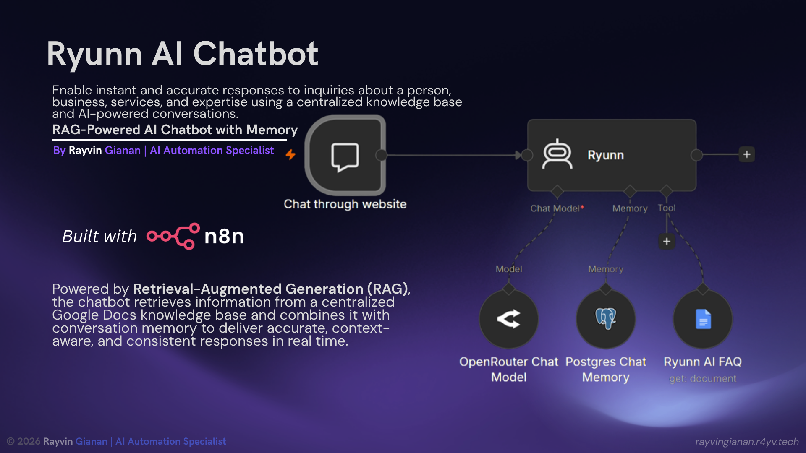
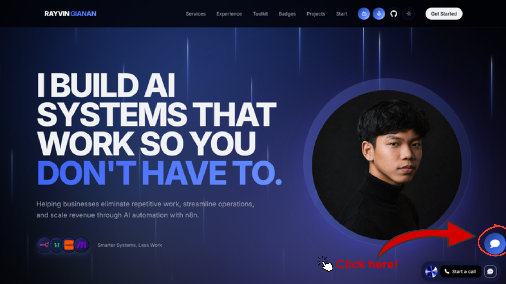
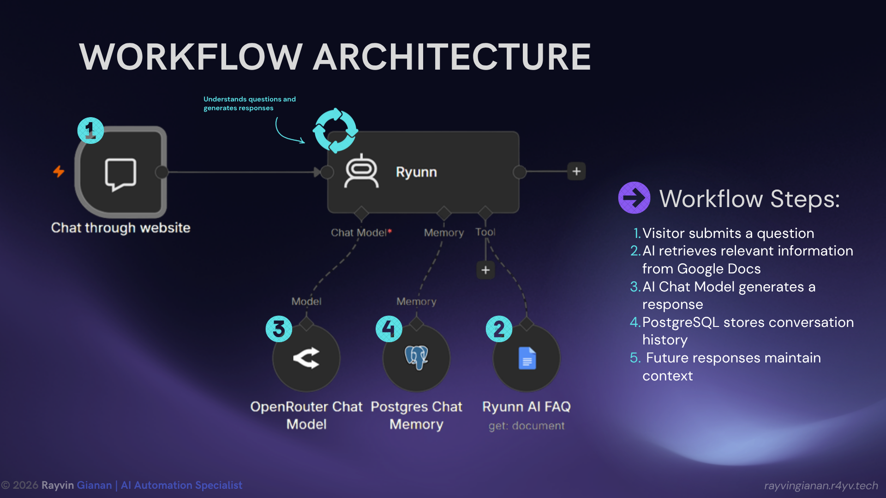
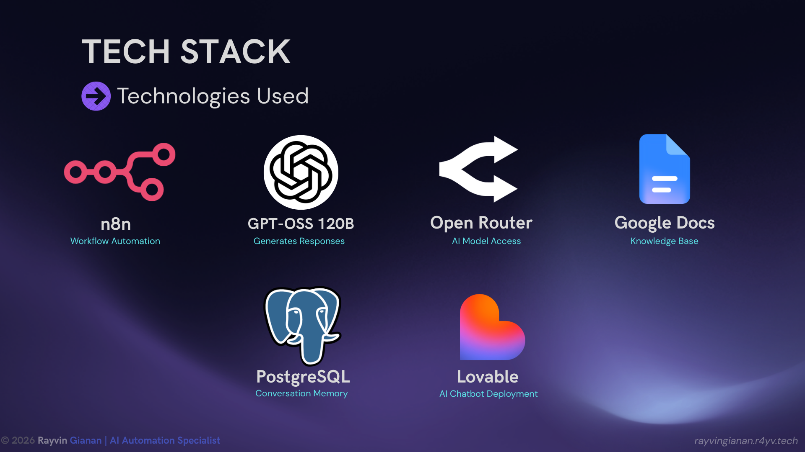
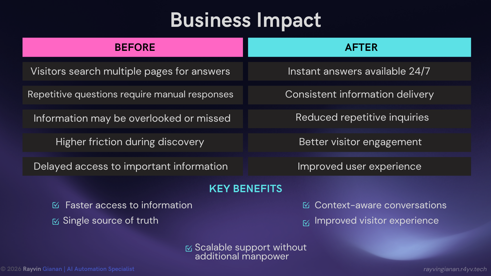

# Ryunn RAG AI Chatbot

[]()
[]()
[]()
[](https://n8n.io/)
[](https://openrouter.ai/)
[]()
[]()
[]()
[]()



> A Retrieval-Augmented Generation (RAG) powered AI chatbot that provides accurate, context-aware responses about my skills, projects, services, and expertise using a centralized knowledge base and conversation memory.

---

# Overview

Ryunn AI Chatbot is an AI-powered knowledge assistant built using **Retrieval-Augmented Generation (RAG)**.

Instead of relying only on the language model's existing knowledge, Ryunn retrieves relevant information from a dedicated knowledge base and combines it with conversation memory to generate accurate and personalized responses.

The chatbot is designed to help visitors quickly learn about:

- Skills and expertise
- Previous projects
- AI automation services
- Technical background
- Available solutions
- Contact information

The goal is to create a self-service AI assistant that allows users to access important information instantly without manually searching through multiple pages.

---

# Live Demo

The Ryunn AI Chatbot is available through my portfolio website:

🌐 https://rayvingianan.r4yv.tech/

To interact with Ryunn:

1. Visit my portfolio website.
2. Click the chatbot button.
3. Ask questions about my background, projects, skills, or services.



---

# Project Snapshot

| Category | Details |
| --- | --- |
| Project Type | AI Knowledge Assistant |
| AI Architecture | Retrieval-Augmented Generation (RAG) |
| Main Purpose | Answer questions about skills, projects, and expertise |
| Knowledge Source | RYUNN AI FAQ Knowledge Base |
| Workflow Automation | n8n |
| AI Model | GPT-OSS 120B through OpenRouter |
| Memory System | PostgreSQL |
| Deployment Interface | Lovable |

---

# Features

- 🤖 AI-powered conversational assistant
- 🔎 Retrieval-Augmented Generation (RAG)
- 📚 Knowledge retrieval from a centralized document
- 🧠 Conversation memory for maintaining context
- 💬 Natural language question answering
- 🎯 Controlled responses based on intended purpose
- ⚡ Real-time AI responses
- 🌐 Available 24/7 through portfolio website

---

# Problem

## Information Should Be Easy To Access

Visitors often want to quickly learn about:

- Who I am
- My technical skills
- Previous projects
- Available services
- Tools and technologies I use
- How to contact me

However, information can become difficult to discover when it is spread across multiple pages.

This creates challenges:

- Visitors spend more time searching for answers
- Repetitive questions require manual responses
- Important information may be overlooked
- Users experience unnecessary friction

---

# Solution

## AI & RAG Powered Knowledge Assistant

Ryunn solves this problem by providing an AI assistant that retrieves information from a centralized knowledge base and generates responses based on the retrieved information.

The chatbot acts as a digital assistant that can answer questions about my portfolio, experience, and automation services while maintaining conversation context.

---

# Knowledge Base & RAG Retrieval System

The foundation of Ryunn is the **RYUNN AI FAQ** document.

This document acts as the chatbot's source of knowledge and contains structured information about:

- Personal background
- AI automation expertise
- Services offered
- Previous projects
- Technologies used
- Business solutions
- Contact information

Example questions stored in the knowledge base:

- "Who is Rayvin Gianan?"
- "What does Rayvin do?"
- "What services does Rayvin offer?"
- "What tools does Rayvin use?"
- "What AI models does Rayvin use?"
- "What kinds of automations can Rayvin build?"
- "How can I contact Rayvin?"

Instead of manually programming every possible response, Ryunn retrieves the relevant information from this document and uses it as context when generating answers.

---

# How RAG Works



The Retrieval-Augmented Generation process:

```
User Question
      |
      v
Question Understanding
      |
      v
Search Knowledge Base
(RYUNN AI FAQ)
      |
      v
Retrieve Relevant Information
      |
      v
AI Response Generation
      |
      v
Store Conversation Memory
(PostgreSQL)
      |
      v
Context-Aware Answer
```

Workflow steps:

1. A visitor submits a question.
2. The system analyzes the user's request.
3. Relevant information is retrieved from the RYUNN AI FAQ knowledge base.
4. The AI model generates an answer using the retrieved context.
5. Conversation history is stored.
6. Future messages maintain previous conversation context.

---

# Why RAG Instead Of A Normal Chatbot?

A traditional chatbot relies mainly on predefined responses.

Ryunn uses RAG because:

- Information can be updated through the knowledge base.
- Responses are grounded in provided information.
- The AI does not need to memorize every detail.
- The chatbot can provide more personalized answers.
- It reduces the chance of incorrect responses.

This makes the assistant more reliable for portfolio and business information.

---

# AI Safety & Guardrails

Ryunn is designed with response boundaries to maintain its intended purpose.

The chatbot is instructed to focus only on topics related to:

- Rayvin's background
- AI automation services
- Projects
- Skills
- Portfolio information
- Business workflows

If users ask unrelated questions, Ryunn avoids generating unnecessary responses and redirects the conversation back to its intended purpose.

This helps:

- Reduce unnecessary token usage
- Improve response consistency
- Prevent irrelevant conversations
- Keep the AI assistant focused

---

# Technologies Used



| Technology | Purpose |
| --- | --- |
| n8n | Workflow automation and AI orchestration |
| GPT-OSS 120B | AI response generation |
| OpenRouter | AI model access |
| Google Docs | Knowledge base storage |
| PostgreSQL | Conversation memory |
| Lovable | Chatbot deployment interface |

---

# Business Impact



AI knowledge assistants can help businesses improve customer and visitor experiences.

Potential benefits:

| Before | After |
| --- | --- |
| Visitors search multiple pages for answers | Instant AI-powered responses |
| Repetitive questions require manual replies | Automated assistance available 24/7 |
| Information is difficult to discover | Centralized knowledge access |
| Higher friction during discovery | Faster user experience |

Key advantages:

- Faster access to information
- Consistent responses
- Reduced repetitive inquiries
- Scalable information delivery

---

# Limitations

- Response quality depends on the information available in the knowledge base.
- The chatbot is designed for specific information retrieval, not general conversations.
- Knowledge updates require updating the connected document.
- AI responses should still be reviewed for important decisions.

---

# Future Improvements

Possible future improvements:

- Multi-source knowledge retrieval
- Website content synchronization
- Voice-based AI assistant
- Advanced analytics dashboard
- More personalized conversations
- Additional memory capabilities

The long-term vision is to evolve Ryunn from a chatbot into a complete AI Knowledge Assistant capable of retrieving information from multiple sources and providing accurate answers at scale.

---

# Repository Structure

```
.
├── README.md
│
└── images/
    ├── ryunn-ai-rag-chatbot-cover.png
    ├── ryunn-architecture.png
    ├── ryunn-tech-stack.png
    ├── ryunn-business-impact.png
    └── how-to-use-ryunn.png
```

---

# Project Status

This repository serves as a portfolio showcase of the Ryunn AI Chatbot architecture, implementation, and AI engineering concepts.

The live chatbot is available through my portfolio website:

🌐 https://rayvingianan.r4yv.tech/

---

# Author

**Rayvin Gianan**

AI Automation Specialist


Portfolio:
https://rayvingianan.r4yv.tech/

---

# Acknowledgements

This project was built using:

- n8n
- OpenRouter
- GPT-OSS 120B
- Google Docs
- PostgreSQL
- Lovable